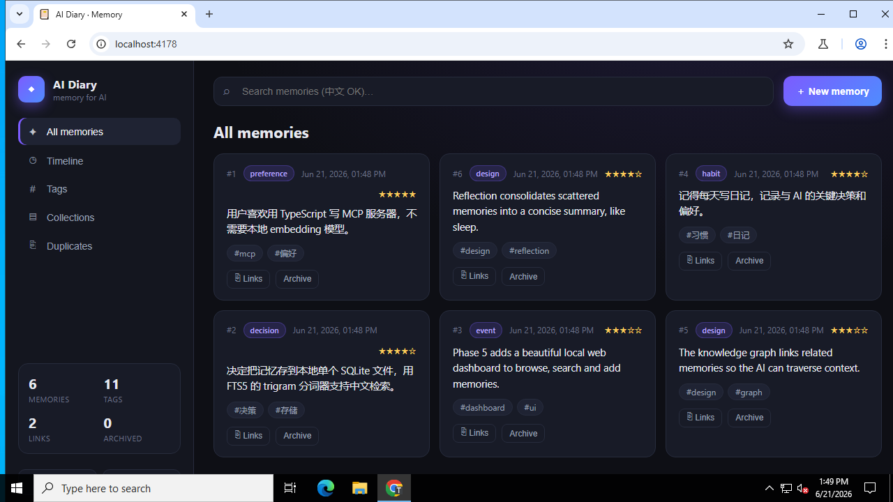
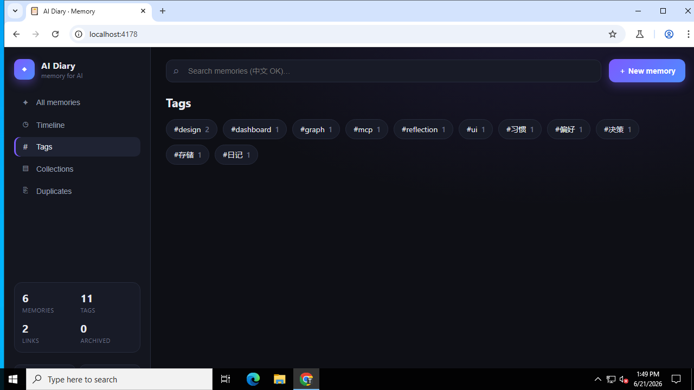
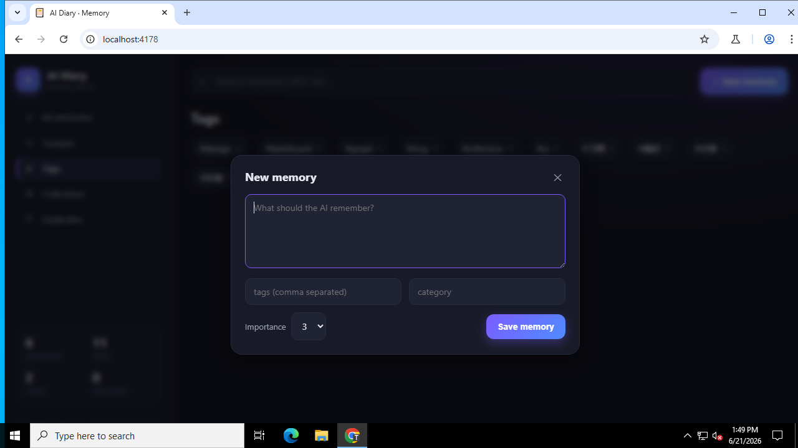

<div align="center">


<p>
  <b>A private, local-first MCP server that gives any AI long-term memory — its own diary.</b><br/>
  Zero models · zero network · zero subscription. Smarter search than Notion, running entirely on your machine.
</p>

<p>
  
  
  
  
  
  
</p>

<p>
  <a href="#-quick-start">Quick start</a> ·
  <a href="#-the-dashboard">Dashboard</a> ·
  <a href="#-connect-it-to-your-ai">Connect</a> ·
  <a href="#-tools">Tools</a> ·
  <a href="#-why-its-better-than-notion">Why</a>
</p>

</div>

---

## ✨ Highlights

- 🔒 **Truly private.** Every memory lives in one SQLite file on your disk. Nothing is ever uploaded.
- 🧠 **No embeddings, still smart.** Retrieval uses SQLite **FTS5 + BM25** with a **trigram tokenizer**, so search is instant and works great for **English *and* 中文 / CJK**.
- 🤝 **Borrows your platform's brain.** When the host supports MCP *sampling*, `recall` expands & re-ranks and `reflect` auto-summarizes — with graceful fallback when it doesn't. The server itself never ships a model.
- 🕸️ **A real knowledge graph.** Link memories and traverse the web of context.
- 🗂️ **Collections, tags, importance, reflection, dedup.** Organize like Notion — locally and programmatically.
- 🎨 **A beautiful local dashboard.** Browse, search, and add memories in your browser (dark & light).
- 🧩 **Works everywhere MCP does.** Claude Desktop, Cursor, Windsurf, Cline, VS Code, Zed…

## 🖥️ The dashboard

A polished local web UI over the same database — `npm run dashboard`, then open `http://localhost:4178`.

<div align="center">
  
  <br/><br/>
  <table>
    <tr>
      <td width="50%"></td>
      <td width="50%"></td>
    </tr>
    <tr>
      <td align="center"><sub>Tags, including 中文</sub></td>
      <td align="center"><sub>Add a memory in a click</sub></td>
    </tr>
  </table>
</div>

Browse · full-text search (English + 中文) · filter by tag/collection · spot near-duplicates · add memories · dark/light theme · one-click git snapshot.

## 🏆 Why it's better than Notion

| | **AI Diary** | Notion |
| --- | --- | --- |
| Privacy | 100% local, single file you own | Cloud-hosted |
| Built for AI | Native MCP tools an agent calls directly | Manual / limited API |
| Chinese search | FTS5 trigram — precise CJK substring search | Weak |
| Knowledge graph | First-class links + graph traversal | No |
| Offline | Always | No |
| Cost | Free, no subscription | Paid tiers |
| Versioning | Optional git history of your memory | Limited |

## 🚀 Quick start

```bash
git clone https://github.com/pangxianggang/ai-diary-mcp.git
cd ai-diary-mcp
npm install
npm run build      # produces dist/index.js — the stdio MCP server
npm run smoke      # self-test (26 assertions)
```

Try the dashboard with some sample data:

```bash
AI_DIARY_DB_PATH=./demo.db node scripts/seed-demo.mjs
AI_DIARY_DB_PATH=./demo.db npm run dashboard      # http://localhost:4178
```

> Override the port with `AI_DIARY_PORT`.

## 🎨 The design philosophy

> The server is the **hippocampus** — fast storage, structure, and retrieval.
> Your platform's model is the **cortex** — it reasons, summarizes, and decides what to remember.

The server never calls an LLM and never goes online. That keeps it private, free, and trivially portable.

## 💾 Where memories are stored

A single SQLite file:

| OS      | Default path                                         |
| ------- | ---------------------------------------------------- |
| Windows | `%APPDATA%\ai-diary\memory.db`                       |
| macOS   | `~/Library/Application Support/ai-diary/memory.db`   |
| Linux   | `$XDG_DATA_HOME/ai-diary/memory.db` (or `~/.local/share/...`) |

Override with `AI_DIARY_DB_PATH`. Back up by copying the file. Keep it inside a git repo and call `snapshot` for versioned memory history.

## 🔌 Connect it to your AI

Use the absolute path to the built `dist/index.js`.

### Claude Desktop

`claude_desktop_config.json` (Settings → Developer → Edit Config):

```json
{
  "mcpServers": {
    "ai-diary": {
      "command": "node",
      "args": ["/absolute/path/to/ai-diary-mcp/dist/index.js"]
    }
  }
}
```

### Cursor / Windsurf / Cline / Zed / VS Code

All use the same shape — `command: "node"` with `args` pointing at `dist/index.js`. Add an `env` block to relocate the database:

```json
{
  "mcpServers": {
    "ai-diary": {
      "command": "node",
      "args": ["/absolute/path/to/ai-diary-mcp/dist/index.js"],
      "env": { "AI_DIARY_DB_PATH": "/absolute/path/to/my-memory.db" }
    }
  }
}
```

Restart the client after editing its config.

## 🧰 Tools

| Tool         | What it does |
| ------------ | ------------ |
| `remember`   | Save a memory (`content`, optional `tags`, `category`, `importance` 1–5, `occurred_at`). Identical content is de-duplicated. |
| `recall`     | Search by text (FTS5 BM25, CJK-aware) with optional `tags` / `category` / `collection_id` / time filters. `smart=true` adds host-model query expansion + re-ranking (with fallback). |
| `recent`     | List the most recently created memories. |
| `timeline`   | Browse chronologically by when things occurred. |
| `get`        | Fetch one memory by id, including its links. |
| `update`     | Edit an existing memory. |
| `forget`     | Archive (default) or hard-delete a memory. |
| `link`       | Connect two memories into a knowledge graph (e.g. `caused`, `related`). |
| `graph`      | Traverse the knowledge graph around a memory (BFS to a depth) and return connected memories + links. |
| `find_duplicates` | Surface near-duplicate memories via trigram similarity. |
| `create_collection` / `add_to_collection` / `list_collections` | Group memories into Notion-like collections. |
| `list_tags`  | All tags with usage counts. |
| `stats`      | Totals, categories, time range, db location. |
| `export`     | Export memories as Markdown. |
| `reflect`    | Consolidate related memories. `auto=true` (with host sampling) summarizes and stores the reflection, linked to its sources. |
| `snapshot`   | Commit the SQLite file to git for versioned memory history. |

**Resource** `memory://recent` (recent entries as Markdown) · **Prompt** `recall-about` (recall + summarize a topic).

## 🧱 Capabilities by phase

1. **MVP** — SQLite + FTS5 (CJK trigram) + full CRUD over stdio, one-line client config.
2. **Smart retrieval** — optional MCP-sampling query expansion + re-ranking in `recall`, automatic fallback to plain FTS5.
3. **Structure** — tags, **collections**, links / **knowledge graph** traversal, importance, soft-forget.
4. **Reflection** — `reflect auto=true` consolidates memories via the host model; `find_duplicates` for de-duplication.
5. **Experience** — a polished local **web dashboard** + Markdown export + optional **git-versioned** history.

## 🔍 How search works (without embeddings)

1. **FTS5 + BM25** ranks entries by relevance. The **trigram** tokenizer indexes 3-character sequences, which is what makes substring and CJK search work.
2. **Metadata filters** (tags, category, collection, time range, importance) narrow results.
3. Queries shorter than 3 characters fall back to a `LIKE` substring scan.
4. With `smart=true`, a sampling-capable host expands the query and re-ranks candidates — but the core works fully without it.

## 🛠️ Development

```bash
npm run dev        # tsc --watch
npm run typecheck  # type-check only
npm run smoke      # in-memory end-to-end check (26 assertions)
npm run dashboard  # local web UI
```

## 📄 License

MIT
